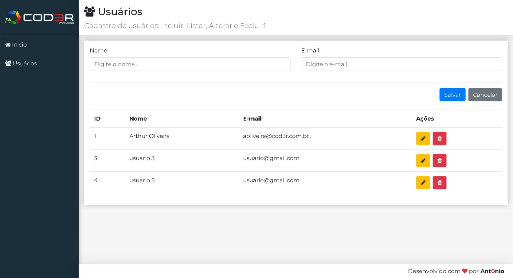

# CRUD

    

## 🚀 Tecnologias

Esse projeto foi desenvolvido com as seguintes tecnologias:

- HTML
- CSS
- JavaScript
- React.js

## 🚀 Desenvolvido

- Durante o Curso de Desenvolvimento Web-Moderno, Ministrado pelo Leonardo Moura Leitão (Arquiteto de Software)

## Comandos

> npm i 
- Para baixar as dependencias.

> cd frontend
 
> npm start

- Em outro terminal.

> cd backend
 
> npm start 

📩 Contato
antoniomiltonaa19@gmail.com
